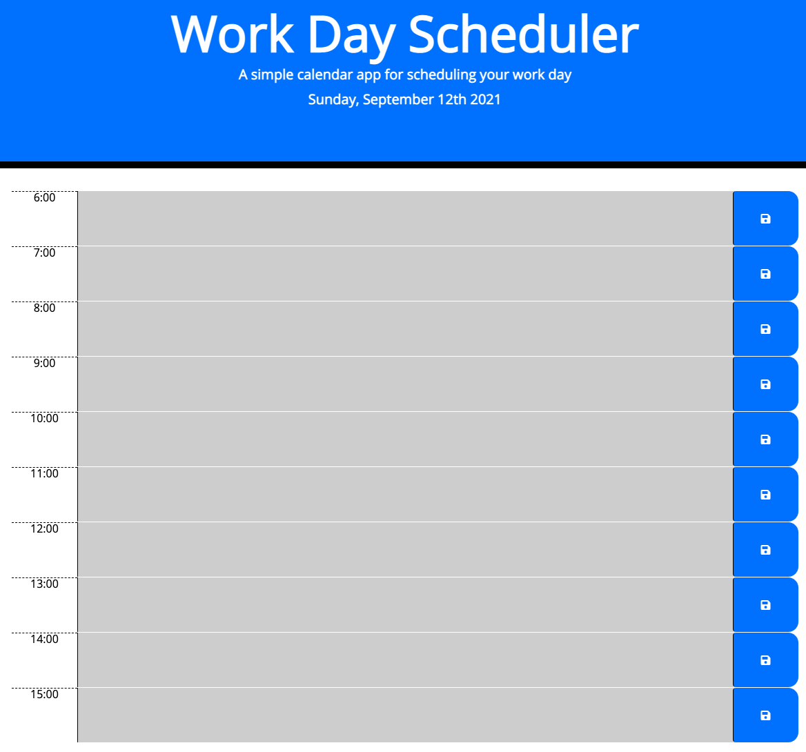

# Work Day Scheduler 🗓

Work Day Scheduler is a simple yet powerful planner to keep you on track while on a busy work day.

## Quirks 🎯

Work Day Scheduler will grey out past time blocks, will highlight in red the current time block, and will highlight in green future time blocks.

This will only work whilst in a 6 to 3 working schedule. Otherwise the schedule will look all grey'd out.

## Preview 👀
[Link](https://evalecillos.github.io/Work-Day-Scheduler/)

## License 📓
[MIT](https://choosealicense.com/licenses/mit/)